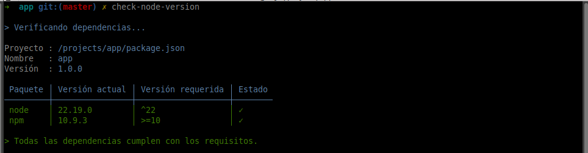
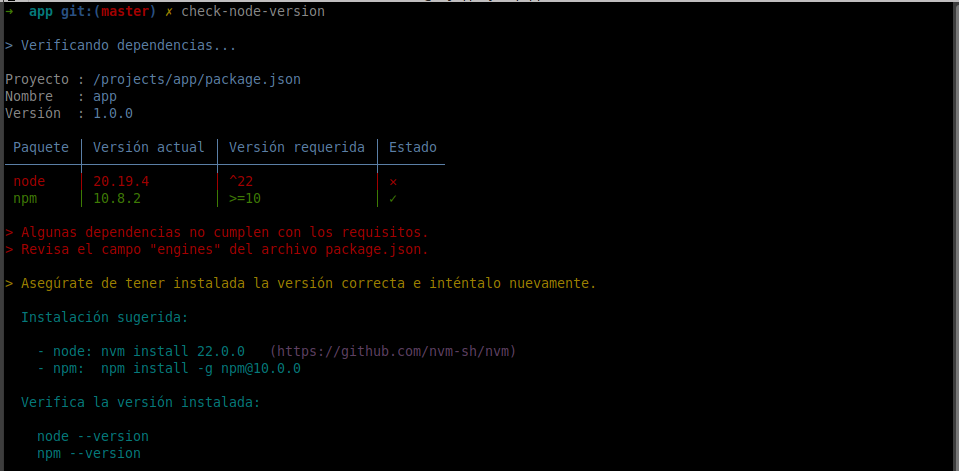
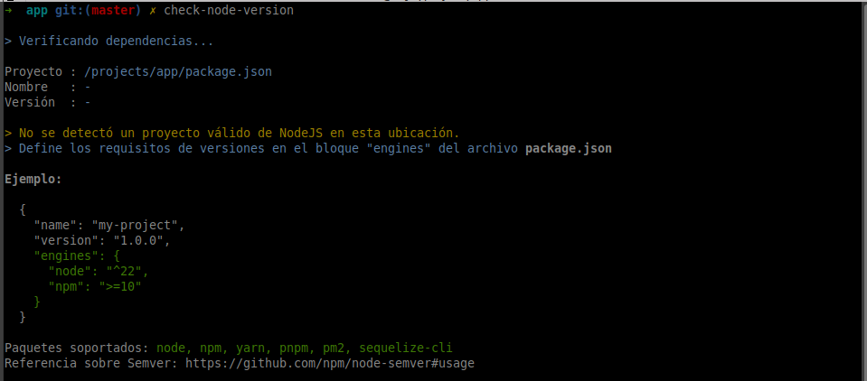
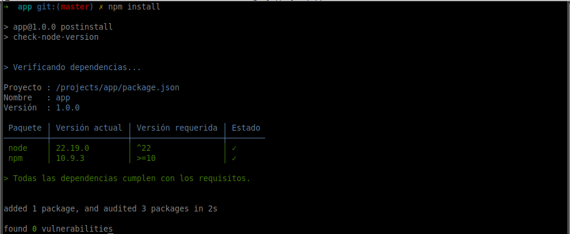
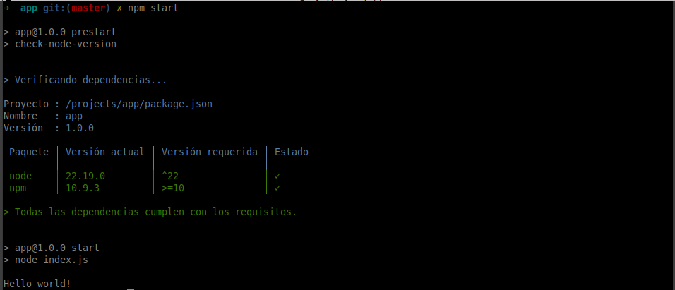

<h1 align="center">Check node version</h1>

<p align="center">
  <a href="https://github.com/ElArteDelCodigo/check-node-version/releases">
    
  </a>
  <a href="https://github.com/ElArteDelCodigo/check-node-version/blob/main/LICENSE">
    
  </a>
  <a href="https://www.npmjs.com/package/@elartedelcodigo/check-node-version">
    
  </a>
  <a href="#uso">
    
  </a>
</p>

CLI para validar que las versiones de tus herramientas coincidan con lo declarado en `package.json` (`engines`). Útil para garantizar entornos coherentes en desarrollo y CI/CD.

## Características

- Soporta: `node`, `npm`, `yarn`, `pnpm`, `pm2`, `sequelize-cli`.

- Detecta automáticamente un proyecto NodeJS si existe `package.json` en el directorio actual.

- Si no hay `engines`, no realiza validaciones y finaliza con éxito.

## Instalación

```bash
# Global
npm install -g @elartedelcodigo/check-node-version

# Verifica
check-node-version --version

  1.2.0
```

## Configuración

Define los rangos de versiones en el `package.json` usando `engines` (semver):

```json
{
  "name": "my-project",
  "version": "1.0.0",
  "engines": {
    "node": "^22",
    "npm": ">=10"
  }
}
```

Referencia semver: https://github.com/npm/node-semver#usage

### Scripts recomendados

Agrega validaciones como `prestart`/`postinstall` para fallar temprano si hay incompatibilidades:

```json
{
  "scripts": {
    "postinstall": "check-node-version",
    "prestart": "check-node-version",
    "start": "node index.js"
  }
}
```

## Ejemplo de uso global

Si se cumplen los requisitos



Si no se cumplen los requisitos



Si nos encontramos en la carpeta incorrecta



## Ejemplo de uso dentro de un proyecto de NodeJS

```txt
app/
  ├── index.js
  └── package.json
```

```js
// index.js
console.log('Hello world!');
```

Archivo `package.json`

```json
{
  "name": "app",
  "version": "1.0.0",
  "description": "",
  "main": "index.js",
  "scripts": {
    "start": "node index.js",
    "postinstall": "check-node-version",
    "prestart": "check-node-version"
  },
  "engines": {
    "node": "^22",
    "npm": ">=10"
  },
  "dependencies": {
    "@elartedelcodigo/check-node-version": "1.2.0"
  }
}
```

Resultado al instalar las dependencias:



Resultado al ejecutar la aplicación:



## Códigos de salida

- `0`: todas las herramientas cumplen con `engines`, no hay `engines`, o no es un proyecto de NodeJS (no hay `package.json`).
- `1`: al menos una herramienta no cumple el rango indicado en `engines`.

## Licencia

MIT — consulta [LICENSE](./LICENSE) para los términos.
